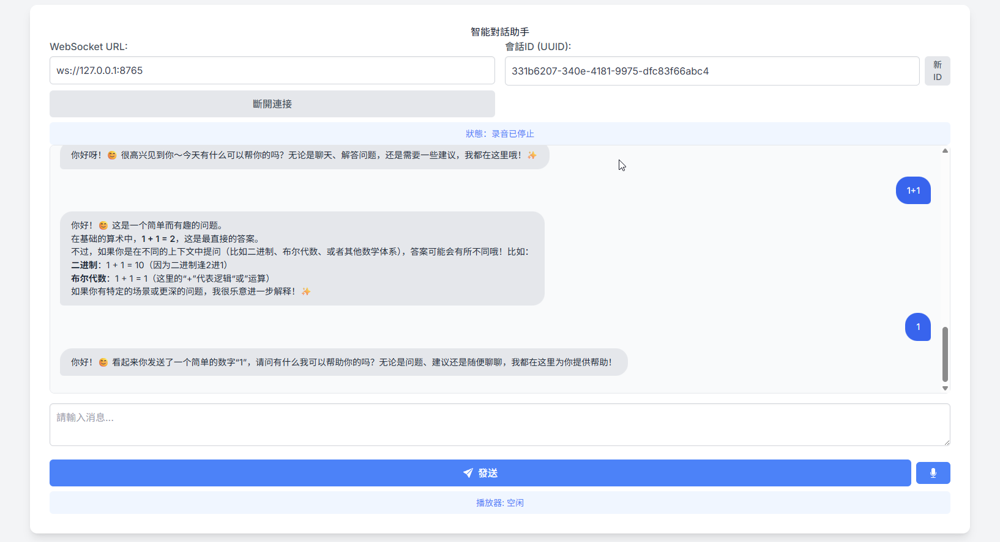

# 实时流式语音对话机器人 (Real-time Streaming Voice Chatbot)

<p align="center">


</p>

这是一个基于Python和WebSocket的实时语音对话机器人框架。它被设计为一个高度模块化、可插拔的系统，允许开发者轻松替换或扩展其核心组件，如语音活动检测(VAD)、自动语音识别(ASR)、大语言模型(LLM)和语音合成(TTS)。

该项目旨在提供一个低延迟、支持打断、具备上下文感知能力的对话体验。



## ✨ 主要功能

- **实时音频流**: 客户端通过WebSocket持续将麦克风音频流发送到服务器。
- **后端语音活动检测 (VAD)**: 服务器端实时检测音频流中的语音活动，智能判断用户说话的开始和结束。
- **1秒快速响应**: 在用户停止说话后，系统仅需1秒静音即可触发后续处理，响应迅速。
- **流式处理链**: ASR、LLM、TTS全链路支持流式处理，最大程度减少用户等待时间。
- **对话打断**: 用户可以随时打断正在播放的AI语音回答，系统会立即停止播放并处理新的用户输入。
- **上下文感知**: 在用户打断对话时，系统能将上一轮的用户问题与本轮的补充内容结合，形成更完整的上下文后发送给LLM。
- **模块化设计**: VAD, ASR, LLM, TTS等核心功能均被设计为独立的、可替换的模块，方便集成不同的服务或模型。
- **易于扩展**: 通过实现基础模块接口并更新工厂类，可以轻松添加新的实现（例如，集成一个新的TTS服务）。

## 🏛️ 系统架构

系统采用客户端-服务器架构，通过WebSocket进行全双工通信。

```
+------------------+      (WebSocket)      +--------------------------+
|                  | <-------------------> |                          |
|  Web Client      |      (Binary & JSON)    |   WebSocket Handler      |
| (web_client.html)|                       | (websocket_handler.py)   |
| - Audio Capture  |                       | - Session Management     |
| - Audio Playback |                       | - Event Orchestration    |
|                  |                       |                          |
+------------------+                       +-----------+--------------+
                                                       |
                                                       | (每个用户一个实例)
                                                       v
                                           +--------------------------+
                                           |      Audio Consumer      |
                                           |    (AudioConsumer.py)    |
                                           | - Backend VAD            |
                                           | - Audio Buffering        |
                                           | - Silence Detection (1s) |
                                           +-----------+--------------+
                                                       |
                                                       v
+----------------+      +----------------+      +----------------+      +----------------+
|      VAD       | <--- |      ASR       | ---> |      LLM       | ---> |      TTS       |
| (silero_vad)   |      | (SenseVoice)   |      |  (LangChain)   |      |   (edge_tts)   |
+----------------+      +----------------+      +----------------+      +----------------+
```

## 📂 项目结构

```
chat-bot/
│
├── applications/         # 客户端应用 (如 web_client.html)
├── adapters/             # 适配器层，将具体实现封装成标准模块
│   ├── asr/
│   ├── llm/
│   ├── tts/
│   └── vad/
├── configs/              # 配置文件 (config.yaml)
├── core/                 # 核心引擎、会话管理和模块初始化
├── data_models/          # Pydantic数据模型 (如 StreamEvent)
├── models/               # 本地AI模型文件 (如 VAD, ASR 模型)
├── modules/              # 各个功能模块的基础抽象类 (base_asr.py 等)
├── service/              # 核心服务 (如 AudioConsumer.py)
├── utils/                # 工具函数和日志设置
├── app.py                # 主启动文件
└── requirements.txt      # Python依赖
```

## 🚀 快速开始

### 1. 环境准备

- 确保你已安装 Python 3.9 或更高版本。

- 建议使用虚拟环境：

  ```
  python -m venv venv
  source venv/bin/activate  # On Windows, use `venv\Scripts\activate`
  ```

### 2. 安装依赖

从项目根目录运行以下命令来安装所有必需的Python库：

```
pip install -r requirements.txt
```

### 3. 模型文件

- **VAD**: 本项目使用的 `silero-vad` 模型通常会在首次运行时由代码自动下载。
- **ASR**: 本项目使用的 `SenseVoice` 模型文件已包含在 `models/asr/SenseVoiceSmall/` 目录中。

请确保 `models` 目录及其内容已正确放置在项目中。

### 4. 配置

项目的主要配置位于 `configs/config.yaml` 文件中。你可以在此文件中修改：

- WebSocket服务器的地址和端口。
- 选择要使用的VAD, ASR, LLM, TTS模块实现。
- 各个模块的特定参数（例如，LLM的模型名称、API密钥等）。

**示例 `config.yaml`**:

```
server:
  host: "0.0.0.0"
  port: 8000

modules:
  vad:
    - id: "vad"
      adapter: "silero_vad_adapter"
      # ...
  asr:
    - id: "asr"
      adapter: "funasr_sensevoice_adapter"
      # ...
  llm:
    - id: "llm"
      adapter: "langchain_llm_adapter"
      # ...
  tts:
    - id: "tts"
      adapter: "edge_tts_adapter"
      # ...
```

### 5. 启动服务

运行主程序来启动WebSocket服务器：

```
python app.py
```

服务器成功启动后，你会看到类似以下的输出：

```
[服务器] WebSocket 服务器已在 ws://0.0.0.0:8000 启动。
```

### 6. 运行客户端

在你的网页浏览器中，直接打开 `applications/web_client.html` 文件。

- **连接**: 页面加载后，确认WebSocket URL正确，然后点击“连接”按钮。
- **对话**: 连接成功后，点击“开始录音”按钮（麦克风图标），然后开始说话。

## ⚙️ 工作流程

1. **连接建立**: 客户端与服务器建立WebSocket连接，服务器为该连接创建一个唯一的会话(Session)和一个专用的 `AudioConsumer` 实例。
2. **音频采集**: 用户点击“开始录音”后，客户端的 `AudioWorklet` 开始采集麦克风音频，将其重采样为16kHz、16-bit的PCM格式，并通过WebSocket以二进制流的形式发送到服务器。
3. **VAD过滤与缓冲**: `AudioConsumer` 接收到音频块。它首先使用VAD判断音频块是否包含语音。只有包含语音的音频才会被存入缓冲区。
4. **静音检测**: `AudioConsumer` 的监控循环持续检查。如果检测到用户停止说话超过1秒，它会将缓冲区中的所有音频拼接成一个完整的片段。
5. **ASR处理**: 完整的音频片段被送入ASR模块进行语音识别。ASR返回的文本会经过清洗，去除模型特定的标记（如 `<|nospeech|>`）。
6. **上下文处理**: `WebSocketHandler` 检查本次输入是否为一次“打断”。如果是，它会将上一轮的用户文本与本次识别出的文本拼接起来。
7. **LLM调用**: 最终形成的文本被发送给LLM模块。
8. **TTS与流式播放**: LLM以流的形式返回回答。`WebSocketHandler` 将文本流切分成句子，并立即对每个句子进行TTS合成。合成后的音频数据（Base64编码）被发送回客户端进行播放。
9. **打断处理**: 如果在TTS播放期间，`AudioConsumer` 再次检测到用户语音，`WebSocketHandler` 会立即设置中断标志，停止后续的TTS生成和发送，并优先处理新的用户输入。

## 🔧 自定义与扩展

本项目的模块化设计使得扩展变得简单。例如，要添加一个新的TTS服务（如Google TTS）：

1. **创建新适配器**: 在 `adapters/tts/` 目录下，创建一个新文件 `google_tts_adapter.py`。
2. **实现基类**: 在该文件中，创建一个类（如 `GoogleTTSAdapter`），继承自 `modules.base_tts.BaseTTS`，并实现其抽象方法 `text_to_speech_block`。
3. **注册到工厂**: 打开 `adapters/tts/tts_factory.py`，导入你的新适配器类，并在 `tts_adapters` 字典中添加一个新的条目，例如：`"google_tts_adapter": GoogleTTSAdapter`。
4. **修改配置**: 在 `configs/config.yaml` 文件中，将 `tts` 模块的 `adapter` 字段值修改为 `"google_tts_adapter"`。

重启服务后，系统将自动加载并使用你的新TTS模块。对VAD, ASR, LLM的扩展也遵循同样的模式。